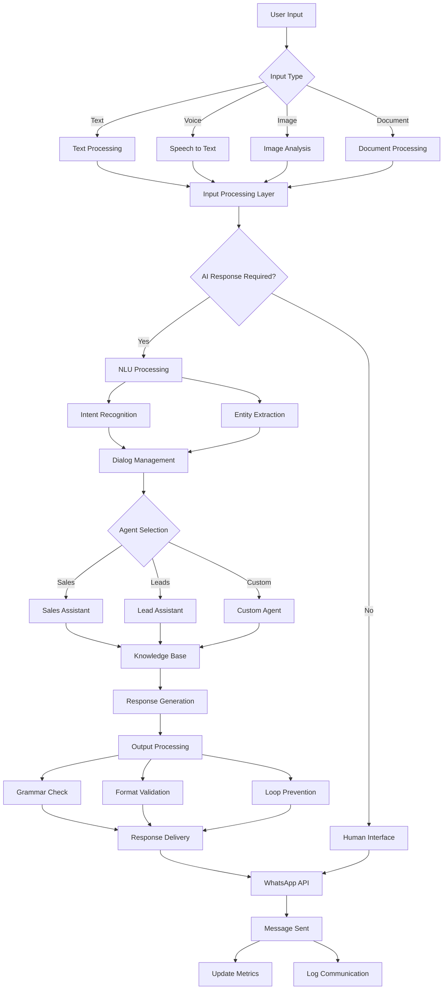
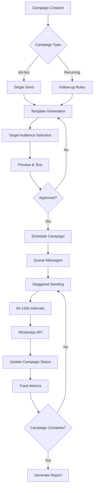
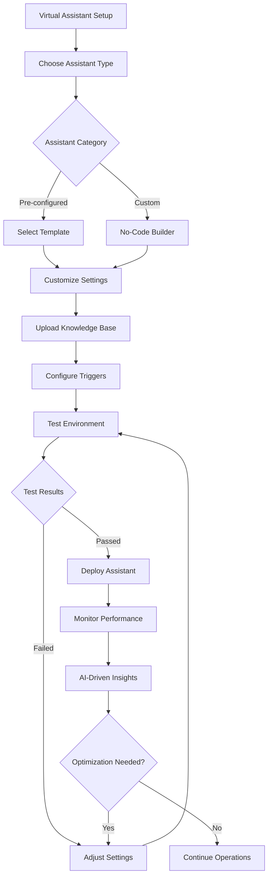
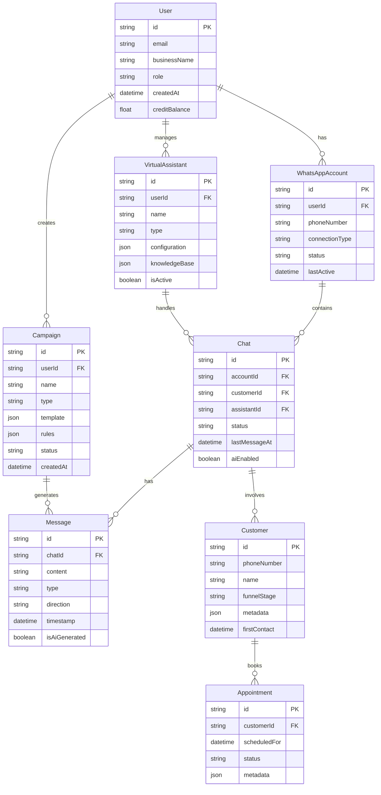
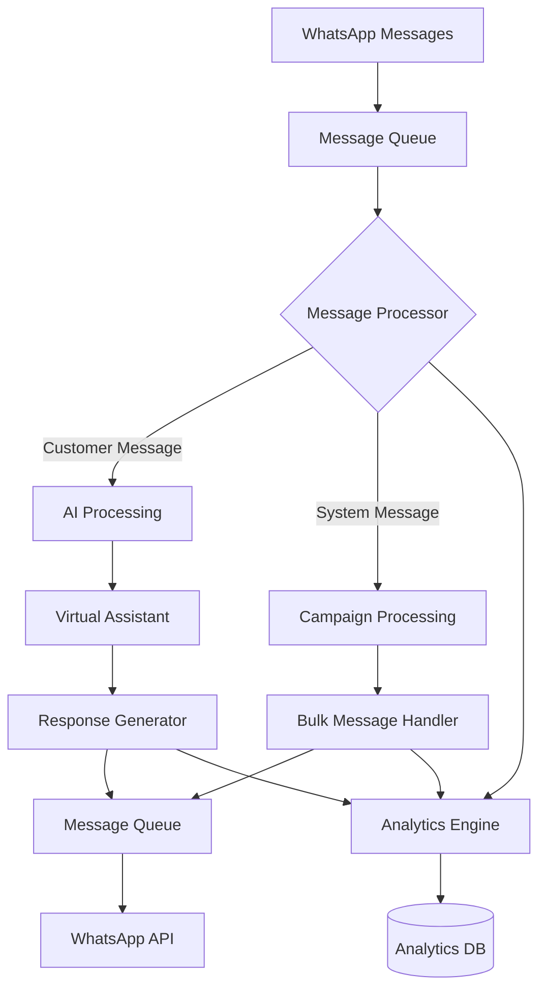
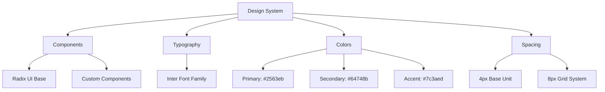
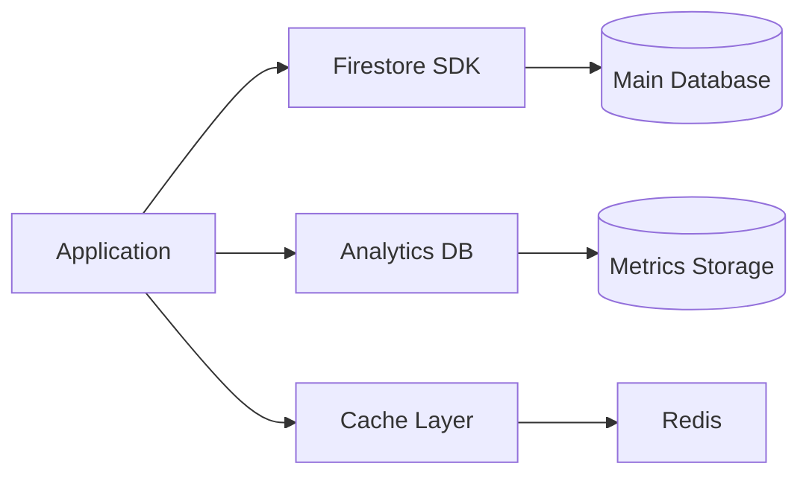

# Product Requirements Document (PRD)

# 1. INTRODUCTION

## 1.1 Purpose

This Software Requirements Specification (SRS) document provides a comprehensive description of the Porfin platform - an AI-powered WhatsApp automation system for businesses. The document is intended for:

- Development team members implementing the system
- Project managers overseeing development
- Quality assurance teams validating requirements
- Business stakeholders evaluating feature completeness
- Future maintainers of the system

## 1.2 Scope

Porfin is a web-based platform that enables businesses to create, deploy and manage AI-powered virtual assistants for WhatsApp communication. The system encompasses:

### 1.2.1 Core Capabilities
- WhatsApp integration via both Web and Business API
- AI-powered virtual assistant creation and management
- Real-time chat interface with AI response toggling
- Campaign management for bulk messaging
- Analytics dashboard for business metrics
- No-code assistant customization tools

### 1.2.2 Key Benefits
- Automated customer communication
- Reduced manual workload for businesses
- Data-driven insights into customer interactions
- Streamlined appointment scheduling and sales processes
- Flexible customization without coding knowledge

### 1.2.3 Technical Boundaries
- Web application built with Next.js frontend
- Python FastAPI backend services
- Firebase/Firestore for data persistence
- JavaScript microservices for WhatsApp connectivity
- Integration with OpenAI's GPT models
- Google Cloud infrastructure deployment

### 1.2.4 Out of Scope
- Native mobile applications
- Multi-region deployment
- Complex sharding or scalability optimizations
- Support for messaging platforms other than WhatsApp

# 2. PRODUCT DESCRIPTION

## 2.1 Product Perspective

Porfin operates as a standalone web-based SaaS platform that integrates with several external systems:

- WhatsApp Web via Baileys JavaScript microservice
- WhatsApp Business API via official Platform API microservice 
- OpenAI GPT models for AI assistant capabilities
- Google Calendar for appointment scheduling
- Firebase/Firestore for data persistence
- Google Cloud infrastructure for hosting

The system architecture follows a modular design with:
- Next.js frontend application
- Python FastAPI backend services
- JavaScript microservices for WhatsApp connectivity
- Cloud-based data storage and processing

## 2.2 Product Functions

The core functions of Porfin include:

| Function Category | Key Capabilities |
|------------------|------------------|
| WhatsApp Integration | - Connect multiple WhatsApp accounts<br>- Real-time message handling<br>- Bulk messaging campaigns |
| AI Assistants | - Pre-configured virtual agents<br>- No-code assistant customization<br>- Knowledge base integration<br>- Multi-modal input processing |
| Business Operations | - Customer journey tracking<br>- Sales funnel management<br>- Appointment scheduling<br>- Payment processing |
| Analytics | - Real-time metrics dashboard<br>- AI-driven insights<br>- Performance reporting<br>- Campaign tracking |

## 2.3 User Characteristics

### Primary Users: Business Owners/Managers
- Small to medium business operators
- Limited technical expertise
- Focus on operational efficiency
- Need for automated customer communication
- Portuguese language proficiency

### Secondary Users: Staff/Operators
- Customer service representatives
- Sales team members
- Healthcare professionals
- Basic computer literacy
- Daily platform interaction

### Technical Users: Administrators
- System administrators
- Technical support staff
- Advanced platform configuration
- Integration management

## 2.4 Constraints

### Technical Constraints
- Limited to web browser access (no native mobile apps)
- Single-region deployment initially
- WhatsApp platform limitations and policies
- API rate limits from third-party services

### Business Constraints
- Brazilian Portuguese language requirement
- R$1 per unique customer/month pricing model
- Initial R$20 free credit limit
- MVP focus without enterprise-scale features

### Regulatory Constraints
- Brazilian data protection regulations
- WhatsApp Business Platform terms of service
- Healthcare data privacy requirements
- Payment processing regulations

## 2.5 Assumptions and Dependencies

### Assumptions
- Users have stable internet connectivity
- Business owners have WhatsApp Business accounts
- Target market accepts AI-powered communication
- Users can operate web-based interfaces
- Basic technical support requirements

### Dependencies
- WhatsApp API availability and stability
- OpenAI API service continuity
- Google Cloud platform services
- Firebase/Firestore availability
- Third-party integration stability:
  - Google Calendar
  - Payment gateways
  - CRM systems (future integration)

# 3. PROCESS FLOWCHART







# 4. FUNCTIONAL REQUIREMENTS

## 4.1 User Authentication & Management

### ID: FR-101
### Description
User registration and authentication system with role-based access control
### Priority: High
### Requirements

| Requirement ID | Description | Acceptance Criteria |
|---------------|-------------|-------------------|
| FR-101.1 | Email-based registration | - Valid email format validation<br>- Password strength requirements<br>- Business name field (optional)<br>- Duplicate email prevention |
| FR-101.2 | Google Sign-In integration | - OAuth 2.0 implementation<br>- Automatic profile creation<br>- Account linking capability |
| FR-101.3 | Role-based permissions | - Admin role access<br>- Manager role access<br>- Operator role access<br>- Role-specific UI elements |
| FR-101.4 | User profile management | - Profile editing<br>- Password reset<br>- Business information updates |

## 4.2 WhatsApp Integration

### ID: FR-102
### Description
Dual WhatsApp integration system via Web and Business API
### Priority: High
### Requirements

| Requirement ID | Description | Acceptance Criteria |
|---------------|-------------|-------------------|
| FR-102.1 | Baileys WhatsApp Web integration | - QR code scanning<br>- Session management<br>- Real-time message sync<br>- Multi-device support |
| FR-102.2 | Official WhatsApp Business API | - API credentials management<br>- Webhook handling<br>- Message template approval<br>- Business profile setup |
| FR-102.3 | Message handling | - Text message support<br>- Media message support<br>- Document handling<br>- Voice message processing |
| FR-102.4 | Connection management | - Auto-reconnection<br>- Status monitoring<br>- Error handling<br>- Session persistence |

## 4.3 Virtual Assistant Management

### ID: FR-103
### Description
AI-powered virtual assistant creation and management system
### Priority: High
### Requirements

| Requirement ID | Description | Acceptance Criteria |
|---------------|-------------|-------------------|
| FR-103.1 | Pre-configured assistants | - Lead Assistant template<br>- Sales Assistant template<br>- Template customization<br>- Knowledge base integration |
| FR-103.2 | No-code assistant builder | - Drag-and-drop interface<br>- Flow visualization<br>- Logic configuration<br>- Response customization |
| FR-103.3 | Assistant testing | - Test environment<br>- Multi-modal input testing<br>- Response validation<br>- Performance metrics |
| FR-103.4 | Assistant deployment | - Version control<br>- A/B testing<br>- Performance monitoring<br>- Real-time updates |

## 4.4 Campaign Management

### ID: FR-104
### Description
WhatsApp campaign creation and management system
### Priority: High
### Requirements

| Requirement ID | Description | Acceptance Criteria |
|---------------|-------------|-------------------|
| FR-104.1 | Campaign creation | - Template generation<br>- Variable support<br>- Audience segmentation<br>- Schedule configuration |
| FR-104.2 | Campaign types | - Ad-hoc campaigns<br>- Recurring campaigns<br>- Follow-up rules<br>- Custom intervals |
| FR-104.3 | Campaign execution | - Staggered sending (60-120s)<br>- Progress tracking<br>- Error handling<br>- Status updates |
| FR-104.4 | Campaign analytics | - Delivery rates<br>- Response rates<br>- Conversion tracking<br>- Performance reporting |

## 4.5 Analytics & Reporting

### ID: FR-105
### Description
Business metrics and analytics dashboard
### Priority: Medium
### Requirements

| Requirement ID | Description | Acceptance Criteria |
|---------------|-------------|-------------------|
| FR-105.1 | Real-time metrics | - Chat volume tracking<br>- Response time monitoring<br>- Conversion rates<br>- Custom period selection |
| FR-105.2 | Sales funnel tracking | - Stage classification<br>- Funnel visualization<br>- Stage transition tracking<br>- Conversion analytics |
| FR-105.3 | AI insights | - Trend analysis<br>- Recommendations<br>- Anomaly detection<br>- Performance forecasting |
| FR-105.4 | Report generation | - Custom report builder<br>- Export functionality<br>- Scheduled reports<br>- Multiple formats |

## 4.6 External Integrations

### ID: FR-106
### Description
Third-party service integrations
### Priority: Medium
### Requirements

| Requirement ID | Description | Acceptance Criteria |
|---------------|-------------|-------------------|
| FR-106.1 | Google Calendar | - Appointment scheduling<br>- Calendar sync<br>- Availability checking<br>- Notification system |
| FR-106.2 | Payment processing | - PIX integration<br>- Barcode generation<br>- Credit card processing<br>- Payment status tracking |
| FR-106.3 | CRM integration | - Data synchronization<br>- Contact management<br>- Activity logging<br>- Custom field mapping |
| FR-106.4 | Document storage | - File upload/download<br>- Document indexing<br>- Access control<br>- Version control |

# 5. NON-FUNCTIONAL REQUIREMENTS

## 5.1 Performance Requirements

| Category | Requirement | Target Metric |
|----------|-------------|---------------|
| Response Time | API endpoint response | < 200ms for 95% of requests |
| Message Processing | WhatsApp message handling | < 500ms from receipt to AI processing |
| AI Response Generation | Virtual assistant response time | < 2 seconds for text generation |
| Concurrent Users | Simultaneous active users | Support 1000 concurrent users |
| Database Operations | Query execution time | < 100ms for 90% of queries |
| Real-time Updates | Chat interface synchronization | < 1 second lag |
| Resource Usage | Server CPU utilization | < 70% under normal load |
| Memory Usage | Application memory consumption | < 2GB per service instance |

## 5.2 Safety Requirements

| Category | Requirement | Implementation |
|----------|-------------|----------------|
| Data Backup | Regular automated backups | - Daily Firestore backups<br>- 30-day retention period<br>- Point-in-time recovery |
| Failure Recovery | Service restoration | - Automatic service restart<br>- Data consistency checks<br>- Transaction rollback capability |
| Error Handling | Graceful degradation | - Fallback mechanisms<br>- Error logging<br>- User notifications |
| Rate Limiting | API protection | - 100 requests/minute per user<br>- Automatic throttling<br>- Abuse prevention |
| Message Queue | Campaign processing | - Message queuing system<br>- Retry mechanism<br>- Dead letter queues |

## 5.3 Security Requirements

| Category | Requirement | Implementation |
|----------|-------------|----------------|
| Authentication | User identity verification | - Firebase Authentication<br>- Multi-factor authentication<br>- Session management |
| Authorization | Access control | - Role-based access control<br>- Resource-level permissions<br>- JWT token validation |
| Data Encryption | Information protection | - TLS 1.3 for transit<br>- AES-256 for storage<br>- Key rotation policy |
| API Security | Endpoint protection | - API key management<br>- Request validation<br>- CORS policies |
| Audit Logging | Security monitoring | - Activity logging<br>- Access attempts tracking<br>- Security event alerts |

## 5.4 Quality Requirements

### 5.4.1 Availability
- System uptime: 99.9% excluding planned maintenance
- Maximum planned downtime: 4 hours per month
- Automatic failover for critical services
- Health monitoring and alerting

### 5.4.2 Maintainability
- Modular architecture with microservices
- Comprehensive API documentation
- Automated deployment pipelines
- Code quality standards enforcement
- Regular dependency updates

### 5.4.3 Usability
- Mobile-responsive web interface
- Maximum page load time: 3 seconds
- Intuitive navigation structure
- Accessibility compliance (WCAG 2.1)
- Multi-language support (initially Portuguese)

### 5.4.4 Scalability
- Horizontal scaling capability
- Auto-scaling based on load
- Database connection pooling
- Caching implementation
- Resource optimization

### 5.4.5 Reliability
- Error rate < 0.1% for all operations
- Zero data loss guarantee
- Automated system recovery
- Regular disaster recovery testing
- Service redundancy

## 5.5 Compliance Requirements

| Category | Requirement | Implementation |
|----------|-------------|----------------|
| Data Protection | LGPD compliance | - Data privacy controls<br>- User consent management<br>- Data retention policies |
| WhatsApp Policy | Platform compliance | - Message template approval<br>- Rate limit adherence<br>- Content policy compliance |
| Healthcare | HIPAA guidelines | - PHI data encryption<br>- Access controls<br>- Audit trails |
| Financial | Payment processing | - PCI DSS compliance<br>- Secure payment handling<br>- Transaction logging |
| Infrastructure | Cloud security | - Google Cloud compliance<br>- Security certifications<br>- Regular audits |

# 6. DATA REQUIREMENTS

## 6.1 Data Models

### 6.1.1 Core Entities



## 6.2 Data Storage

### 6.2.1 Primary Storage
- **Firestore Collections** for main application data:
  - Users
  - WhatsApp Accounts
  - Virtual Assistants
  - Chats
  - Messages
  - Customers
  - Campaigns
  - Appointments

### 6.2.2 Data Retention
- Chat history: 12 months
- Campaign data: 24 months
- Customer records: Indefinite
- System logs: 90 days
- Analytics data: 36 months

### 6.2.3 Backup Strategy
- Daily automated Firestore backups
- Retention of 30 daily backups
- Weekly consolidated backups stored for 12 months
- Monthly consolidated backups stored for 36 months
- Point-in-time recovery capability within 30 days

### 6.2.4 Data Redundancy
- Firestore native replication across availability zones
- Real-time data mirroring to analytics database
- Cache layer using Redis for frequently accessed data:
  - Active chat sessions
  - Virtual assistant configurations
  - Campaign status
  - User preferences

## 6.3 Data Processing

### 6.3.1 Data Flow



### 6.3.2 Data Security
- Encryption at rest using AES-256
- TLS 1.3 for data in transit
- Role-based access control (RBAC)
- Field-level encryption for sensitive data:
  - Payment information
  - Personal identification
  - Healthcare data
- Data access logging and auditing
- IP-based access restrictions for admin functions

### 6.3.3 Data Processing Rules
- Message rate limiting: 60-120 seconds between bulk messages
- Automatic data sanitization for user inputs
- Real-time data validation before storage
- Automated data aggregation for analytics
- Asynchronous processing for large datasets
- Automatic archival of inactive chats after 90 days

### 6.3.4 Data Integration
- Webhook support for external systems
- REST API for data exchange
- Real-time event streaming for integrations
- Batch processing for large data imports/exports
- ETL pipelines for analytics data

# 7. EXTERNAL INTERFACES

## 7.1 User Interfaces

### 7.1.1 Web Application Interface

| Component | Description | Requirements |
|-----------|-------------|--------------|
| Dashboard | Main control center | - Responsive layout (Tailwind CSS)<br>- Dark/light mode support<br>- Mobile-first design<br>- Real-time metric updates |
| Chat Interface | WhatsApp-like messaging | - Message history view<br>- AI toggle switch<br>- Multi-modal input support<br>- Real-time updates |
| Virtual Assistant Builder | No-code assistant creation | - Drag-and-drop interface<br>- Visual flow builder<br>- Component library<br>- Preview mode |
| Campaign Manager | Campaign creation and monitoring | - Template editor<br>- Audience selector<br>- Schedule configuration<br>- Status dashboard |

### 7.1.2 Design System



## 7.2 Hardware Interfaces

### 7.2.1 Mobile Device Requirements

| Requirement | Specification |
|-------------|---------------|
| Camera Access | Required for QR code scanning during WhatsApp Web connection |
| Microphone | Optional for voice message input |
| Storage | Minimum 100MB free space for media caching |
| Screen | Minimum 320px width support |

## 7.3 Software Interfaces

### 7.3.1 External Service Integration

| Service | Interface Type | Purpose |
|---------|---------------|----------|
| WhatsApp Web (Baileys) | WebSocket | Real-time message handling and session management |
| WhatsApp Business API | REST API | Official platform integration for business accounts |
| OpenAI API | REST API | GPT model access for AI assistant functionality |
| Google Calendar API | REST API | Appointment scheduling and management |
| Firebase Auth | SDK | User authentication and session management |
| Firestore | SDK | Primary data storage and real-time updates |

### 7.3.2 Database Interfaces



## 7.4 Communication Interfaces

### 7.4.1 API Protocols

| Protocol | Usage | Specifications |
|----------|-------|----------------|
| HTTPS | All external communications | TLS 1.3, Certificate pinning |
| WebSocket | Real-time chat updates | Secure WebSocket (wss://) |
| REST | Service integrations | JSON payload format |
| gRPC | Internal microservices | Protocol buffers v3 |

### 7.4.2 Message Formats

```json
{
  "message": {
    "id": "msg_123",
    "type": "text|media|document",
    "content": "Message content",
    "metadata": {
      "timestamp": "2024-01-01T12:00:00Z",
      "sender": "user_id",
      "recipient": "customer_id"
    },
    "status": "sent|delivered|read"
  }
}
```

### 7.4.3 Network Requirements

| Requirement | Specification |
|-------------|---------------|
| Bandwidth | Minimum 1Mbps upload/download |
| Latency | Maximum 300ms round-trip time |
| Ports | 443 (HTTPS), 8443 (WebSocket) |
| Firewall | Allow outbound to *.whatsapp.net, *.openai.com |
| DNS | IPv4 and IPv6 support |

# 8. APPENDICES

## 8.1 GLOSSARY

| Term | Definition |
|------|------------|
| Virtual Assistant/Agent | AI-powered automated system that handles customer interactions via WhatsApp |
| Knowledge Base | Collection of documents and information used to train virtual assistants |
| Campaign | Scheduled bulk messaging initiative with defined targets and goals |
| Sales Funnel | Sequential stages tracking customer journey from lead to conversion |
| No-code Builder | Visual interface for creating virtual assistants without programming |
| Webhook | HTTP callback that delivers real-time information to other applications |
| PIX | Brazilian instant payment system |
| Template | Pre-defined message structure with variable placeholders |
| Staggered Sending | Technique of sending messages with intervals to avoid platform restrictions |

## 8.2 ACRONYMS

| Acronym | Full Form |
|---------|-----------|
| API | Application Programming Interface |
| CRM | Customer Relationship Management |
| GDPR | General Data Protection Regulation |
| HIPAA | Health Insurance Portability and Accountability Act |
| LGPD | Lei Geral de Proteção de Dados (Brazilian Data Protection Law) |
| LLM | Large Language Model |
| MVP | Minimum Viable Product |
| NLU | Natural Language Understanding |
| PHI | Protected Health Information |
| PRD | Product Requirements Document |
| RBAC | Role-Based Access Control |
| REST | Representational State Transfer |
| SaaS | Software as a Service |
| SDK | Software Development Kit |
| SRS | Software Requirements Specification |
| TLS | Transport Layer Security |
| UI | User Interface |

## 8.3 ADDITIONAL REFERENCES

### 8.3.1 Technical Documentation

| Resource | URL | Purpose |
|----------|-----|----------|
| Baileys WhatsApp Library | https://github.com/WhiskeySockets/Baileys | WhatsApp Web integration reference |
| WhatsApp Business API | https://developers.facebook.com/docs/whatsapp | Official API documentation |
| Next.js Documentation | https://nextjs.org/docs | Frontend framework reference |
| FastAPI Documentation | https://fastapi.tiangolo.com/ | Backend framework reference |
| Firebase Documentation | https://firebase.google.com/docs | Authentication and database reference |

### 8.3.2 Design Resources

| Resource | Purpose |
|----------|----------|
| Radix UI Components | Base component library reference |
| Tailwind CSS | Styling framework documentation |
| Framer Motion | Animation library documentation |
| Inter Font Family | Typography system reference |

### 8.3.3 Regulatory Guidelines

| Resource | Relevance |
|----------|-----------|
| LGPD Compliance Guide | Brazilian data protection requirements |
| WhatsApp Commerce Policy | Messaging platform guidelines |
| Healthcare Data Standards | HIPAA compliance reference |
| Payment Processing Standards | Financial transaction requirements |

## 8.4 REVISION HISTORY

| Version | Date | Author | Changes |
|---------|------|--------|----------|
| 1.0 | 2024-01-01 | Initial Team | First draft of PRD |
| 1.1 | 2024-01-15 | Technical Team | Added technical specifications |
| 1.2 | 2024-01-30 | Product Team | Updated user requirements |
| 1.3 | 2024-02-15 | Security Team | Added compliance requirements |