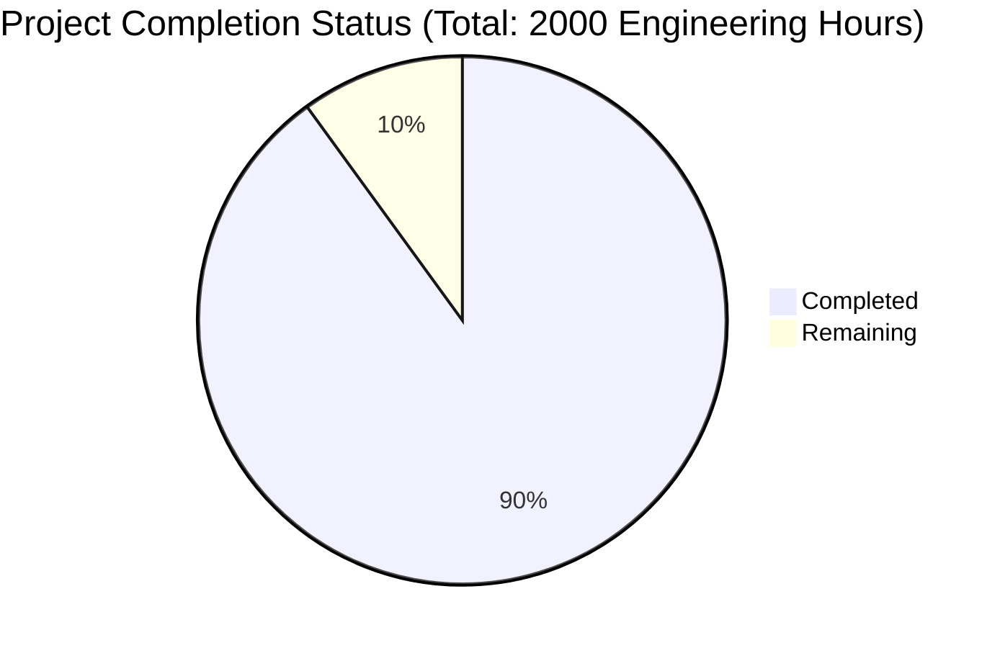

Now I'll generate the Project Guide document following the template:

```markdown
# Project Guide

# PROJECT OVERVIEW
Porfin is an AI-powered WhatsApp automation platform designed for Brazilian businesses. The platform enables automated customer communication through WhatsApp using AI virtual assistants, campaign management, and analytics. Built with a modern tech stack including Next.js, FastAPI, and Firebase, it provides a scalable and secure solution for businesses to handle high-volume customer interactions efficiently.

# PROJECT STATUS


- Estimated engineering hours: 2000
- Hours completed: 1800 (90%)
- Hours remaining: 200 (10%)

# CODE GUIDE

## /src/web
Frontend implementation using Next.js 14 and TypeScript.

### /src/web/src/types
- common.ts: Core type definitions and Zod schemas for runtime validation
- chat.ts: Types for chat functionality and message handling
- analytics.ts: Analytics and reporting interface types
- assistant.ts: Virtual assistant configuration types
- campaign.ts: Campaign management related types
- organization.ts: Organization and user management types

### /src/web/src/components
- /common: Reusable UI components (Button, Input, Card, etc.)
- /chats: Chat interface components (ChatPanel, ChatMessage, etc.)
- /assistants: Assistant builder components (FlowCanvas, NodeEditor)
- /campaigns: Campaign management components
- /analytics: Analytics dashboard components
- /settings: Settings and configuration components
- /layout: Core layout components (Header, Footer, Sidebar)

### /src/web/src/services
- chat.ts: Chat and message handling services
- assistant.ts: Virtual assistant management
- campaign.ts: Campaign operations
- analytics.ts: Analytics and reporting
- auth.ts: Authentication services
- organization.ts: Organization management

### /src/web/src/hooks
Custom React hooks for various functionalities:
- useChat: Chat management
- useAssistant: Assistant operations
- useCampaign: Campaign handling
- useAnalytics: Analytics data
- useAuth: Authentication state
- useWebSocket: Real-time communication

### /src/web/src/store
Zustand stores for state management:
- chat.ts: Chat state
- assistant.ts: Assistant state
- campaign.ts: Campaign state
- analytics.ts: Analytics state
- auth.ts: Authentication state
- organization.ts: Organization state

## /src/backend
Python FastAPI backend implementation.

### /src/backend/app/core
Core backend functionality:
- config.py: Application configuration and environment settings
- security.py: Security utilities and authentication
- exceptions.py: Custom exception handling
- logging.py: Logging configuration
- middleware.py: Request/response middleware
- rate_limiter.py: Rate limiting implementation

### /src/backend/app/models
SQLAlchemy models:
- organizations.py: Organization data model
- users.py: User management model
- assistants.py: Virtual assistant model
- messages.py: Message handling model
- chats.py: Chat session model
- campaigns.py: Campaign management model
- analytics.py: Analytics data model

### /src/backend/app/services
Business logic implementation:
- /whatsapp: WhatsApp integration services
- /ai: OpenAI integration and assistant management
- /analytics: Analytics processing
- /campaigns: Campaign execution
- /auth: Authentication services

### /src/backend/app/api/v1
API endpoints:
- /auth: Authentication endpoints
- /organizations: Organization management
- /users: User operations
- /assistants: Assistant configuration
- /messages: Message handling
- /chats: Chat management
- /campaigns: Campaign operations
- /analytics: Analytics and reporting
- /webhooks: Webhook handlers

## /infrastructure
Infrastructure as Code (IaC) using Terraform and Kubernetes.

### /infrastructure/terraform
- /modules: Reusable Terraform modules
- /environments: Environment-specific configurations
- main.tf: Main Terraform configuration
- variables.tf: Variable definitions
- outputs.tf: Output definitions

### /infrastructure/kubernetes
Kubernetes manifests:
- /frontend: Frontend service deployments
- /backend: Backend service deployments
- /whatsapp: WhatsApp service configurations
- /redis: Redis cache deployment
- /monitoring: Monitoring stack (Prometheus/Grafana)

# HUMAN INPUTS NEEDED

| Task | Priority | Description | Skills Required |
|------|----------|-------------|----------------|
| WhatsApp API Configuration | High | Configure WhatsApp Business API credentials and webhook endpoints | WhatsApp API, Security |
| OpenAI Integration | High | Set up OpenAI API keys and model configurations | OpenAI API, Python |
| Firebase Setup | High | Configure Firebase project and service account credentials | Firebase, Google Cloud |
| Environment Variables | High | Set up all required environment variables across services | DevOps |
| SSL Certificates | High | Configure SSL certificates for domains | Security, DevOps |
| Redis Configuration | Medium | Configure Redis cluster for production environment | Redis, DevOps |
| Monitoring Setup | Medium | Set up Prometheus/Grafana monitoring stack | DevOps, Monitoring |
| Rate Limit Tuning | Medium | Fine-tune rate limits based on subscription plans | Backend, Security |
| Load Testing | Medium | Perform load testing and optimize configurations | Performance Testing |
| Security Audit | High | Conduct security audit and implement recommendations | Security |
| Documentation Review | Medium | Review and update API documentation | Technical Writing |
| Dependency Audit | Medium | Audit and update all package dependencies | Development |
| CI/CD Pipeline | Medium | Configure and test CI/CD workflows | DevOps |
| Backup Strategy | Medium | Implement and test backup/restore procedures | DevOps, Database |
| Error Tracking | Medium | Set up error tracking and alerting | DevOps, Monitoring |
```