# Technical Specifications

# 1. INTRODUCTION

## 1.1 EXECUTIVE SUMMARY

Porfin is an AI-powered WhatsApp automation platform designed to help businesses streamline customer communication and optimize operational efficiency. The system enables users to create, deploy, and manage virtual assistants that handle customer inquiries, schedule appointments, and conduct sales through WhatsApp - Brazil's dominant messaging platform.

The platform addresses the critical challenge of managing high-volume customer communications while maintaining personalized service quality. By combining AI capabilities with WhatsApp's ubiquitous presence, Porfin empowers businesses to scale their customer engagement without proportionally increasing staff overhead.

## 1.2 SYSTEM OVERVIEW

### Project Context

| Aspect | Description |
|--------|-------------|
| Market Position | First-to-market AI-powered WhatsApp automation platform focused on Brazilian SMBs |
| Target Users | Small/medium businesses, healthcare clinics, service providers |
| Current Landscape | Manual WhatsApp business communication with limited automation |
| Enterprise Integration | Standalone SaaS platform with optional CRM/calendar integrations |

### High-Level Description

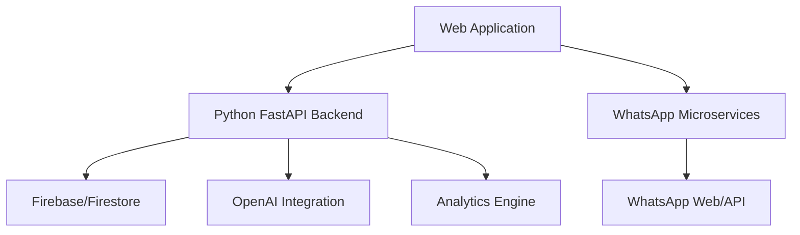

### Success Criteria

| Category | Metrics |
|----------|---------|
| Performance | - API response time < 200ms<br>- Message processing time < 500ms<br>- 99.9% system uptime |
| Business | - 30% reduction in response time<br>- 50% increase in handled inquiries<br>- 20% improvement in conversion rates |
| User Adoption | - 1000+ active businesses<br>- 85% user retention rate<br>- 4.5+ app store rating |

## 1.3 SCOPE

### In-Scope Elements

| Category | Components |
|----------|------------|
| Core Features | - WhatsApp integration (Web/API)<br>- AI virtual assistants<br>- Campaign management<br>- Analytics dashboard<br>- No-code assistant builder |
| User Groups | - Business owners/managers<br>- Customer service staff<br>- Sales teams<br>- Healthcare professionals |
| Technical Scope | - Web application<br>- REST APIs<br>- Database systems<br>- AI/ML integrations<br>- Security infrastructure |
| Geographic Coverage | - Brazil (Portuguese language)<br>- Single-region deployment |

### Out-of-Scope Elements

| Category | Exclusions |
|----------|------------|
| Features | - Native mobile applications<br>- Multi-language support<br>- Non-WhatsApp messaging platforms<br>- Enterprise-scale deployment |
| Technical | - Multi-region infrastructure<br>- Complex sharding mechanisms<br>- Legacy system migrations<br>- Custom hardware requirements |
| Integrations | - Non-Brazilian payment systems<br>- International CRM platforms<br>- Custom API development<br>- Third-party plugin system |
| Support | - 24/7 live support<br>- On-premise deployment<br>- Hardware provisioning<br>- Custom development services |

# 2. SYSTEM ARCHITECTURE

## 2.1 High-Level Architecture

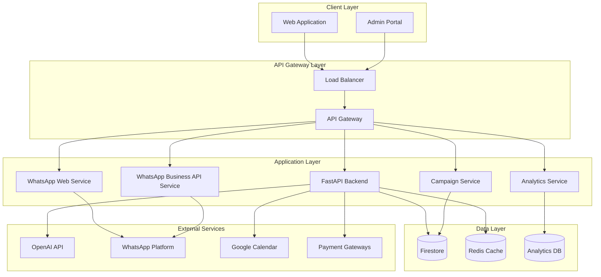

## 2.2 Component Details

### 2.2.1 Core Components

| Component | Purpose | Technology Stack | Scaling Strategy |
|-----------|---------|-----------------|------------------|
| Web Application | User interface | Next.js, Tailwind CSS, Radix UI | Horizontal scaling via CDN |
| API Gateway | Request routing, authentication | Cloud Run, nginx | Auto-scaling based on load |
| FastAPI Backend | Core business logic | Python FastAPI, asyncio | Horizontal pod scaling |
| WhatsApp Services | Message handling | Node.js, Baileys/Official API | Instance per account group |
| Campaign Service | Bulk messaging | Python, Redis Queue | Queue-based worker scaling |
| Analytics Service | Metrics processing | Python, pandas | Resource-based scaling |

### 2.2.2 Data Storage Components

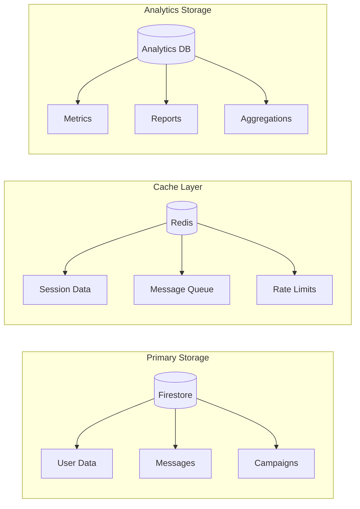

## 2.3 Technical Decisions

### 2.3.1 Architecture Patterns

| Pattern | Implementation | Justification |
|---------|---------------|---------------|
| Microservices | Isolated WhatsApp services | Better scaling, language flexibility |
| Event-driven | Message processing pipeline | Asynchronous processing, decoupling |
| CQRS | Analytics data flow | Separate read/write optimization |
| Cache-aside | Redis implementation | Reduce database load, improve latency |

### 2.3.2 Communication Patterns

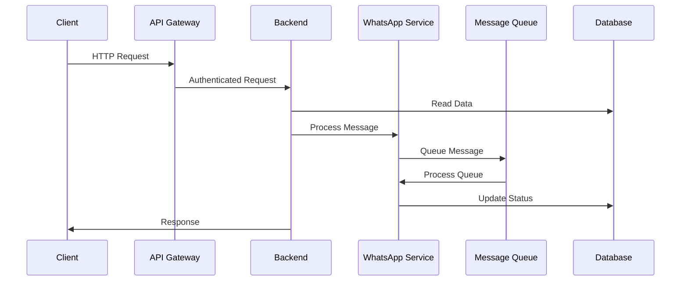

## 2.4 Cross-Cutting Concerns

### 2.4.1 Monitoring Architecture

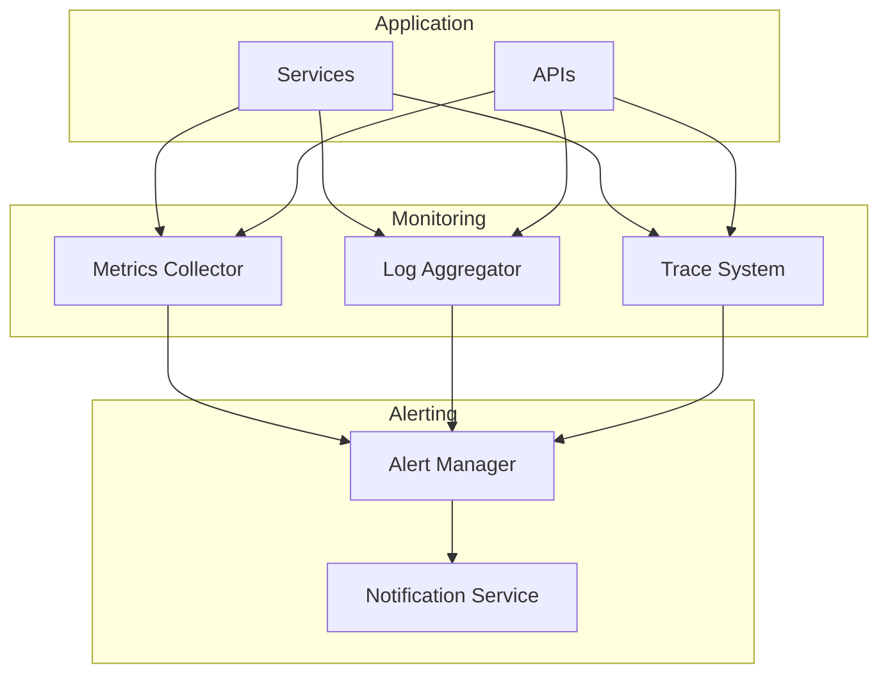

### 2.4.2 Security Architecture

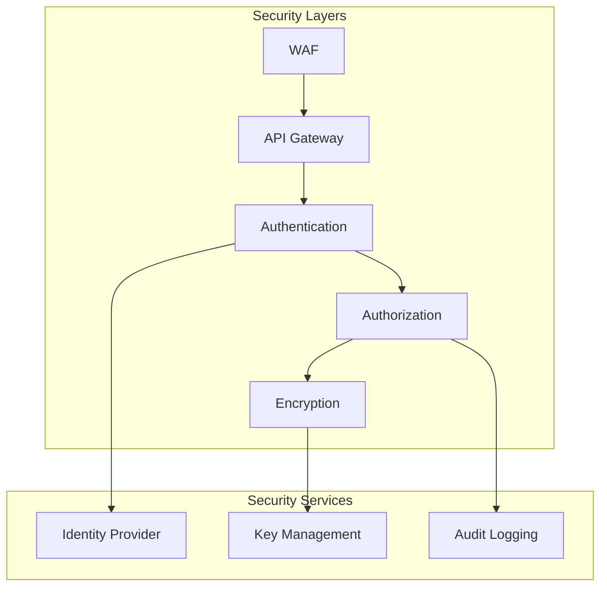

## 2.5 Deployment Architecture

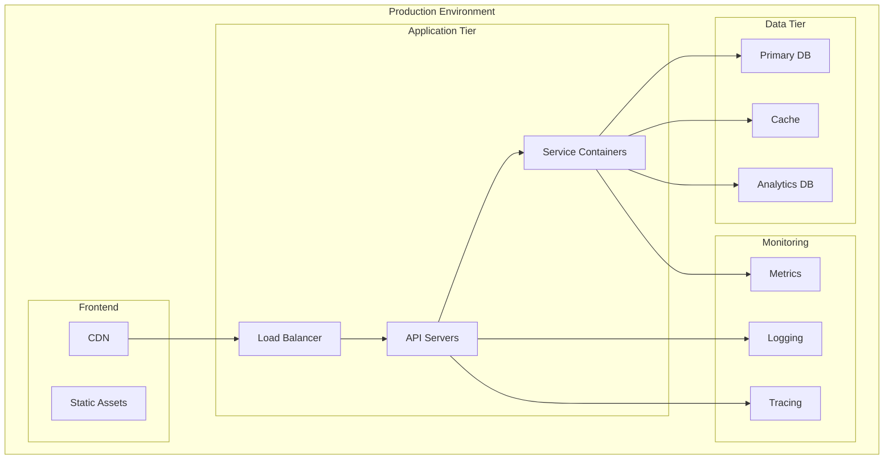

### 2.5.1 Infrastructure Requirements

| Component | Specification | Scaling Limits |
|-----------|--------------|----------------|
| API Servers | 2 vCPU, 4GB RAM | Max 10 instances |
| WhatsApp Services | 2 vCPU, 4GB RAM | 1 per 1000 accounts |
| Redis Cache | 4GB Memory | Cluster mode disabled |
| Firestore | Standard tier | No practical limit |
| Load Balancer | Standard tier | Regional |

### 2.5.2 Disaster Recovery

| Aspect | Strategy | RPO | RTO |
|--------|----------|-----|-----|
| Database | Daily backups + Point-in-time recovery | 1 hour | 4 hours |
| Application | Multi-zone deployment | N/A | 10 minutes |
| File Storage | Cross-region replication | 15 minutes | 1 hour |
| Configuration | Version controlled, automated deployment | N/A | 30 minutes |

## 2.6 Performance Architecture

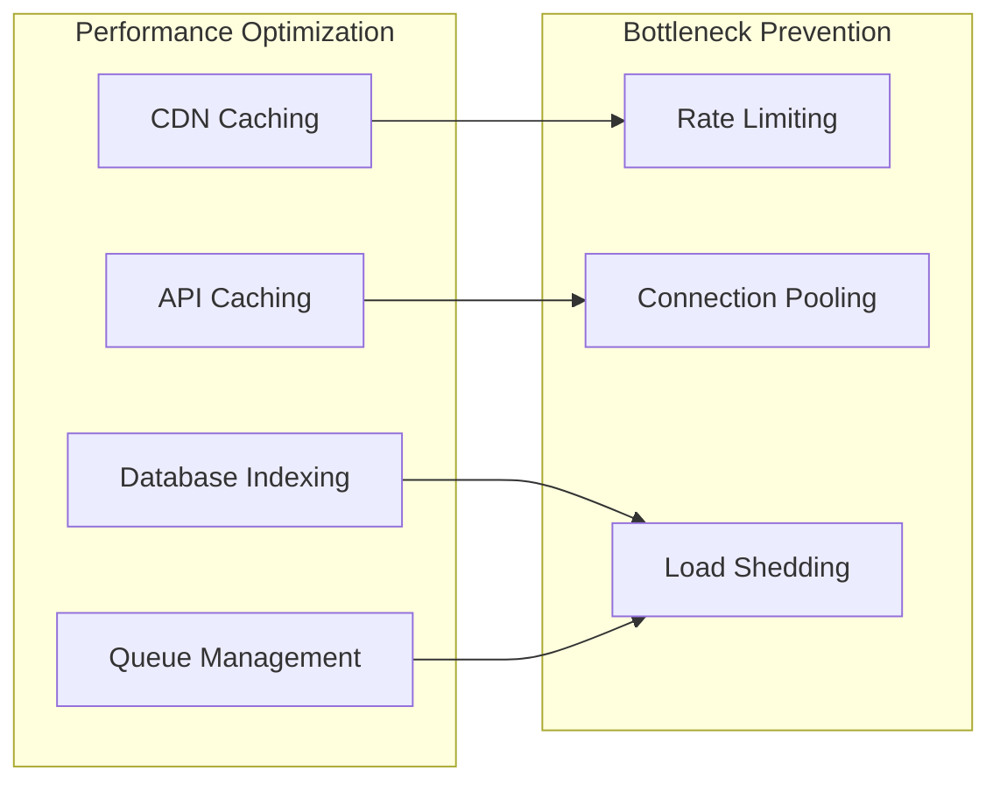

### 2.6.1 Performance Requirements

| Metric | Target | Monitoring |
|--------|--------|------------|
| API Response Time | < 200ms | p95 latency |
| Message Processing | < 500ms | Average time |
| Database Queries | < 100ms | Query performance |
| Cache Hit Rate | > 80% | Redis metrics |
| Concurrent Users | 1000 | Active connections |

# 3. SYSTEM COMPONENTS ARCHITECTURE

## 3.1 USER INTERFACE DESIGN

### 3.1.1 Design System Specifications

| Component | Specification | Implementation |
|-----------|--------------|----------------|
| Typography | Inter Font Family | - Headings: 24/20/16px<br>- Body: 16/14px<br>- Captions: 12px |
| Color Palette | Primary/Secondary/Accent | - Primary: #2563eb<br>- Secondary: #64748b<br>- Accent: #7c3aed<br>- Error: #ef4444 |
| Spacing System | 8px Grid | - Base unit: 4px<br>- Spacing scale: 8/16/24/32/48px |
| Breakpoints | Responsive Design | - Mobile: 320px<br>- Tablet: 768px<br>- Desktop: 1024px<br>- Wide: 1280px |
| Accessibility | WCAG 2.1 AA | - Color contrast 4.5:1<br>- Keyboard navigation<br>- Screen reader support<br>- Focus indicators |

### 3.1.2 Component Library

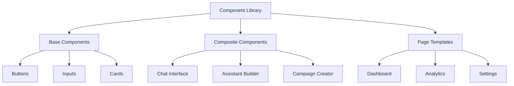

### 3.1.3 Critical User Flows

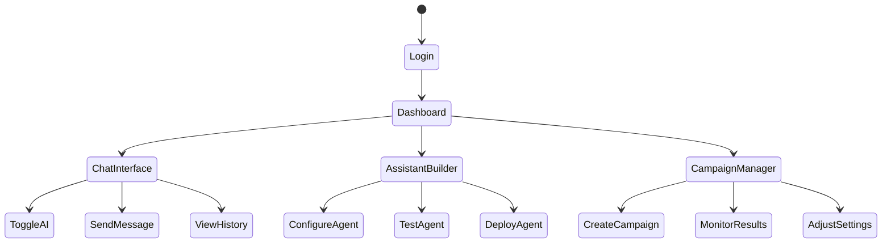

## 3.2 DATABASE DESIGN

### 3.2.1 Schema Design

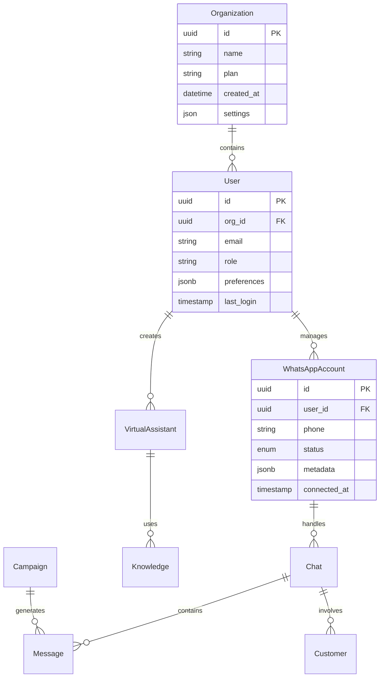

### 3.2.2 Data Management Strategy

| Aspect | Strategy | Implementation |
|--------|----------|----------------|
| Partitioning | Time-based | - Monthly message partitions<br>- Quarterly analytics partitions |
| Indexing | Selective | - B-tree for IDs<br>- GiST for text search<br>- Partial indexes for active records |
| Caching | Multi-level | - Redis L1 cache (5min TTL)<br>- Application cache (1min TTL)<br>- Query cache (15min TTL) |
| Archival | Automated | - 90-day active retention<br>- Yearly archival to cold storage<br>- Compliance-based deletion |

## 3.3 API DESIGN

### 3.3.1 API Architecture

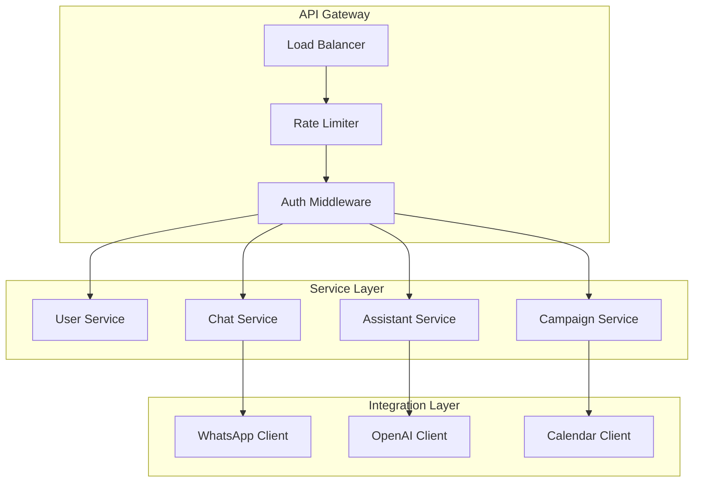

### 3.3.2 Endpoint Specifications

| Endpoint | Method | Purpose | Rate Limit |
|----------|--------|---------|------------|
| /api/v1/auth | POST | Authentication | 10/min |
| /api/v1/messages | GET/POST | Message handling | 100/min |
| /api/v1/assistants | GET/POST/PUT | Assistant management | 50/min |
| /api/v1/campaigns | GET/POST | Campaign operations | 30/min |

### 3.3.3 Integration Patterns

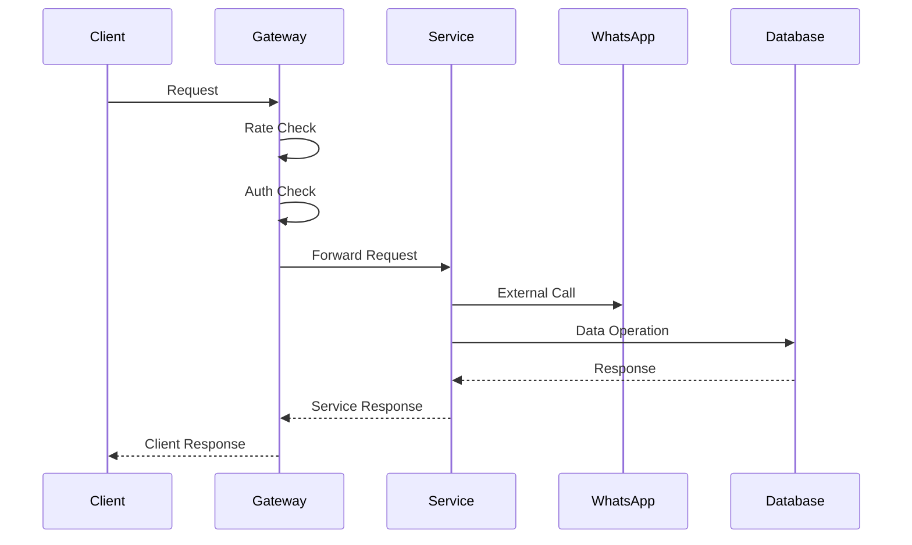

### 3.3.4 Security Controls

| Control | Implementation | Purpose |
|---------|----------------|----------|
| Authentication | JWT + Refresh Tokens | Identity verification |
| Authorization | RBAC + Resource Policy | Access control |
| Rate Limiting | Token Bucket Algorithm | Abuse prevention |
| Input Validation | JSON Schema | Request sanitization |
| Output Encoding | Content-Type Headers | XSS prevention |
| API Versioning | URI Path Version | Compatibility |

# 4. TECHNOLOGY STACK

## 4.1 PROGRAMMING LANGUAGES

| Platform/Component | Language | Version | Justification |
|-------------------|----------|---------|---------------|
| Backend Services | Python | 3.11+ | - Robust AI/ML libraries<br>- FastAPI compatibility<br>- Async support for real-time processing |
| WhatsApp Services | JavaScript | Node 18 LTS | - Native Baileys library support<br>- Event-driven architecture<br>- WebSocket handling |
| Frontend | TypeScript | 5.0+ | - Type safety for large application<br>- Next.js compatibility<br>- Enhanced developer experience |
| Infrastructure | Python/YAML | Latest | - Google Cloud deployment scripts<br>- Configuration management<br>- CI/CD automation |

## 4.2 FRAMEWORKS & LIBRARIES

### Core Frameworks

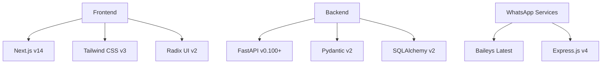

### Supporting Libraries

| Category | Library | Version | Purpose |
|----------|---------|---------|----------|
| State Management | Zustand | 4.x | Frontend state management |
| Forms | React Hook Form | 7.x | Form handling and validation |
| AI/ML | OpenAI SDK | Latest | GPT model integration |
| Testing | Pytest/Jest | Latest | Backend/Frontend testing |
| Monitoring | OpenTelemetry | Latest | Distributed tracing |

## 4.3 DATABASES & STORAGE

### Data Architecture

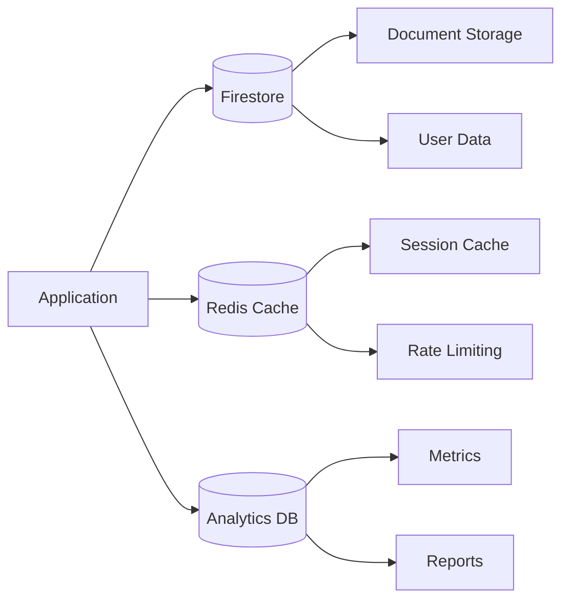

### Storage Solutions

| Type | Technology | Purpose | Configuration |
|------|------------|---------|---------------|
| Primary Database | Firestore | Main data store | Native mode, multi-region |
| Cache Layer | Redis | Session/Performance | 4GB, cluster disabled |
| Analytics | BigQuery | Metrics/Reporting | Standard tier |
| File Storage | Cloud Storage | Media/Documents | Regional bucket |

## 4.4 THIRD-PARTY SERVICES

### Service Integration Architecture

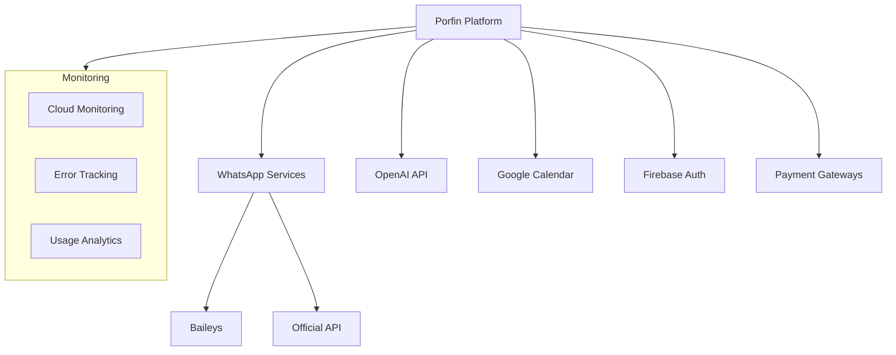

### Service Details

| Service | Provider | Purpose | Integration Method |
|---------|----------|---------|-------------------|
| Authentication | Firebase Auth | User management | SDK integration |
| AI Models | OpenAI | Assistant intelligence | REST API |
| Calendar | Google Calendar | Appointment scheduling | OAuth 2.0 |
| Payments | Various Brazilian | Transaction processing | REST API |
| Monitoring | Google Cloud | System observability | Native integration |

## 4.5 DEVELOPMENT & DEPLOYMENT

### Development Pipeline

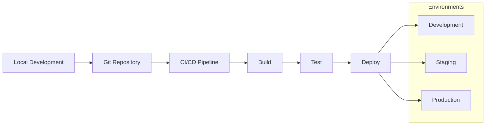

### Infrastructure Components

| Component | Technology | Configuration | Purpose |
|-----------|------------|---------------|----------|
| Container Runtime | Cloud Run | Serverless | Service deployment |
| Build System | Cloud Build | Automated | CI/CD pipeline |
| Version Control | GitHub | Private repos | Code management |
| Infrastructure | Terraform | Declarative | Resource provisioning |
| Monitoring | Cloud Monitoring | Full stack | System observability |

# 5. SYSTEM DESIGN

## 5.1 USER INTERFACE DESIGN

### 5.1.1 Layout Structure

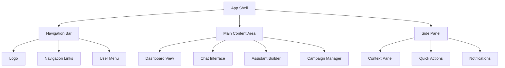

### 5.1.2 Key Interface Components

| Component | Layout | Functionality |
|-----------|---------|--------------|
| Chat Interface | Two-column layout | - Left: Chat list with search<br>- Right: Active chat with AI toggle<br>- Bottom: Multi-modal input bar |
| Assistant Builder | Three-panel layout | - Left: Component library<br>- Center: Flow canvas<br>- Right: Properties panel |
| Campaign Manager | Grid layout | - Campaign cards<br>- Status indicators<br>- Progress metrics<br>- Quick actions |
| Analytics Dashboard | Responsive grid | - Key metrics cards<br>- Interactive charts<br>- Filterable tables<br>- Export options |

### 5.1.3 Responsive Breakpoints

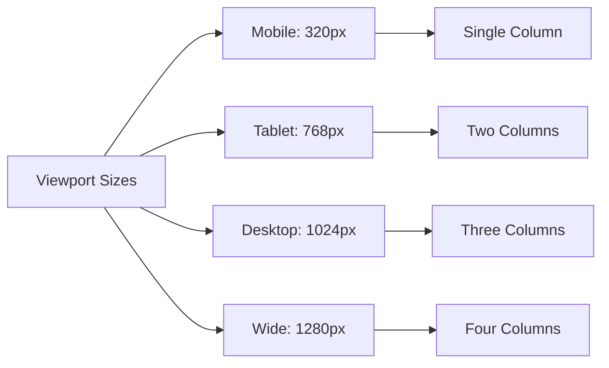

## 5.2 DATABASE DESIGN

### 5.2.1 Data Models

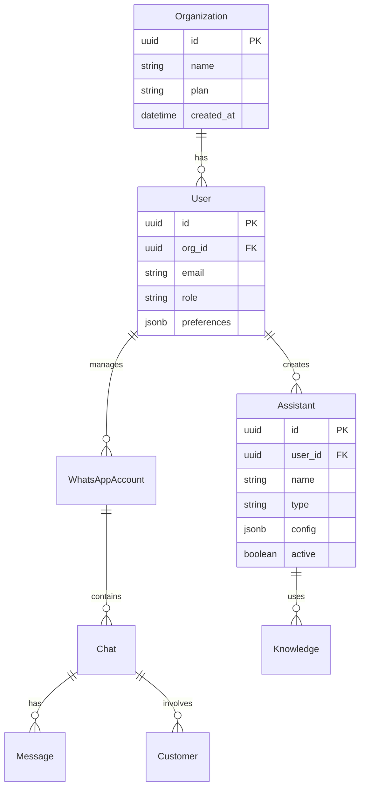

### 5.2.2 Indexing Strategy

| Collection | Indexes | Purpose |
|------------|---------|----------|
| messages | - chat_id, timestamp<br>- customer_id, timestamp | - Chat history queries<br>- Customer timeline |
| chats | - account_id, last_active<br>- customer_id, status | - Active chat lookup<br>- Customer engagement |
| assistants | - user_id, type<br>- active, last_used | - Assistant filtering<br>- Performance monitoring |

### 5.2.3 Data Partitioning

```mermaid
graph TD
    A[Data Partitioning] --> B[Time-based]
    A --> C[Organization-based]
    
    B --> D[Message History]
    B --> E[Analytics Data]
    
    C --> F[User Data]
    C --> G[Assistant Config]
    
    D --> H[Monthly Shards]
    E --> I[Quarterly Shards]
```

## 5.3 API DESIGN

### 5.3.1 REST Endpoints

| Endpoint | Method | Purpose | Request/Response |
|----------|--------|---------|------------------|
| /api/v1/chats | GET | List chats | Pagination, filters |
| /api/v1/messages | POST | Send message | Message payload |
| /api/v1/assistants | PUT | Update assistant | Config updates |
| /api/v1/campaigns | POST | Create campaign | Campaign details |

### 5.3.2 WebSocket Events

```mermaid
sequenceDiagram
    participant Client
    participant Server
    participant WhatsApp
    
    Client->>Server: connect(auth_token)
    Server->>Client: connection_ack
    
    WhatsApp->>Server: incoming_message
    Server->>Client: message_received
    
    Client->>Server: send_message
    Server->>WhatsApp: process_message
    WhatsApp->>Server: message_status
    Server->>Client: status_update
```

### 5.3.3 API Security

| Layer | Implementation | Purpose |
|-------|---------------|----------|
| Authentication | JWT Bearer tokens | Identity verification |
| Rate Limiting | Token bucket algorithm | Abuse prevention |
| Input Validation | JSON Schema | Request sanitization |
| Response Filtering | Field-level policies | Data protection |
| Error Handling | Standard error codes | Consistent responses |

### 5.3.4 Integration Patterns

```mermaid
graph TD
    A[Client Application] --> B{API Gateway}
    
    B --> C[Authentication Service]
    B --> D[Chat Service]
    B --> E[Assistant Service]
    B --> F[Campaign Service]
    
    D --> G[WhatsApp Service]
    E --> H[OpenAI Service]
    F --> I[Analytics Service]
    
    G --> J[Message Queue]
    H --> J
    J --> K[Event Processor]
```

# 6. USER INTERFACE DESIGN

## 6.1 Layout Structure

The application follows a consistent layout pattern across all pages:

```
+----------------------------------------------------------+
|                      Header Bar                           |
| [#] Dashboard   [@] Profile   [!] Notifications   [=] Menu|
+----------------------------------------------------------+
|          |                                                |
|  Navigation    Main Content Area                          |
|          |                                                |
|  [#] Home     +----------------------------------------+ |
|  [*] Chats    |                                        | |
|  [+] Assistant|                                        | |
|  [$] Campaign |                                        | |
|  [i] Reports  |                                        | |
|          |    |                                        | |
|          |    |                                        | |
|          |    |                                        | |
|          |    |                                        | |
+----------+----+----------------------------------------+ |
|                   Footer / Status Bar                     |
+----------------------------------------------------------+
```

## 6.2 Key Screens

### 6.2.1 Chat Interface

```
+----------------------------------------------------------+
| [<] Back   Customer Chat - João Silva   [?] Help          |
+------------------+---------------------------------------+
| Chats           | Chat History                          |
| +-------------+ | +----------------------------------+  |
| | João Silva  | | João: Olá, preciso de ajuda        |  |
| | Maria Santos| | Bot: Olá! Como posso ajudar?       |  |
| | Pedro Lima  | | João: Quero marcar consulta        |  |
| | Ana Costa   | | Bot: Claro! Que dia prefere?       |  |
| +-------------+ | +----------------------------------+  |
|                 |                                       |
| [+] New Chat    | AI Assistant: (ON) [v]               |
|                 | [..................................]  |
|                 | [Send] [^] Attach    [!] Quick Reply |
+-----------------+---------------------------------------+
```

### 6.2.2 Assistant Builder

```
+----------------------------------------------------------+
| Virtual Assistant Builder - Sales Assistant               |
+------------------+---------------------------------------+
| Components       | Flow Canvas                           |
| +-------------+ | +----------------------------------+  |
| | Triggers    | | [Start]                            |  |
| |--Welcome    | |   |                                |  |
| |--Questions  | |   v                                |  |
| |--Responses  | | [Welcome Message]                  |  |
| |--Logic      | |   |                                |  |
| |--Actions    | |   v                                |  |
| +-------------+ | [Product Menu]                     |  |
|                 |   |                                |  |
| Properties      |   v                                |  |
| Name: [.......]| [Price Check]                      |  |
| Type: [v]      |   |                                |  |
| Active: [x]    |   v                                |  |
|                 | [Payment Options]                  |  |
+-----------------+---------------------------------------+
```

### 6.2.3 Campaign Manager

```
+----------------------------------------------------------+
| Campaign Manager                          [+] New Campaign |
+----------------------------------------------------------+
| Active Campaigns                                          |
| +------------------------------------------------------+ |
| | Name          Status    Progress   Results    Actions | |
| |------------------------------------------------------|
| | Welcome      [====]     80%       2.1k sent   [...]  | |
| | Follow-up    [===]      30%       500 sent    [...]  | |
| | Reactivation [=]        10%       100 sent    [...]  | |
| +------------------------------------------------------+ |
|                                                          |
| Campaign Editor                                          |
| Template: [...................................................] |
| Schedule: ( ) Send Now  ( ) Schedule  ( ) Recurring     |
| Target:   [v] All Customers                             |
|           [ ] Filter by segment                         |
|           [ ] Custom list                               |
|                                                          |
| [Test Campaign]  [Save Draft]  [Start Campaign]         |
+----------------------------------------------------------+
```

### 6.2.4 Analytics Dashboard

```
+----------------------------------------------------------+
| Analytics Overview                    Period: [v] Last 30d |
+----------------------------------------------------------+
| Quick Stats                                               |
| +-------------+ +-------------+ +-------------+ +--------+ |
| | Chats       | | Messages    | | Conversion  | | Active | |
| | 1,234       | | 5,678      | | 23%        | | 89%    | |
| | [^] +12%    | | [^] +8%    | | [v] -2%    | | [=] 0% | |
| +-------------+ +-------------+ +-------------+ +--------+ |
|                                                          |
| Response Times                                           |
| [==============================================]         |
| 0s     1s     2s     3s     4s     5s     >5s          |
|                                                          |
| Customer Journey                                         |
| Lead [====] 45% > Engaged [===] 30% > Converted [=] 10% |
|                                                          |
| [Export Report] [Schedule Report] [Share Dashboard]      |
+----------------------------------------------------------+
```

## 6.3 UI Component Key

| Symbol | Meaning |
|--------|---------|
| [#] | Dashboard/Menu icon |
| [@] | User/Profile icon |
| [!] | Notification/Alert |
| [=] | Settings menu |
| [+] | Add/Create new |
| [x] | Close/Delete |
| [?] | Help/Information |
| [$] | Payment/Financial |
| [^] | Upload/Increase |
| [v] | Dropdown/Decrease |
| [...] | Text input field |
| [Button] | Clickable button |
| [====] | Progress bar |
| ( ) | Radio button |
| [ ] | Checkbox |
| +--+ | Container border |
| \|  | Vertical separator |
| > | Flow direction |

## 6.4 Responsive Behavior

The interface adapts to different screen sizes following these breakpoints:

```
Desktop (>1024px)
+------------------+-------------------------+
|   Navigation     |     Main Content       |
|                  |                        |
+------------------+-------------------------+

Tablet (768px-1024px)
+----------------------------------------+
|   Collapsed Navigation [=]              |
|   +--------------------------------+   |
|   |         Main Content           |   |
|   +--------------------------------+   |
+----------------------------------------+

Mobile (<768px)
+----------------------------------------+
|   [=] Menu                             |
+----------------------------------------+
|                                        |
|            Main Content                |
|                                        |
+----------------------------------------+
```

# 7. SECURITY CONSIDERATIONS

## 7.1 AUTHENTICATION AND AUTHORIZATION

### 7.1.1 Authentication Flow

```mermaid
sequenceDiagram
    participant User
    participant Frontend
    participant Gateway
    participant Auth
    participant Firebase
    
    User->>Frontend: Login Request
    Frontend->>Gateway: Auth Request
    Gateway->>Auth: Validate Credentials
    Auth->>Firebase: Verify Identity
    Firebase-->>Auth: Token Response
    Auth-->>Gateway: Session Token
    Gateway-->>Frontend: JWT + Refresh Token
    Frontend-->>User: Authentication Complete
```

### 7.1.2 Authorization Matrix

| Role | Dashboard | Chats | Assistants | Campaigns | Settings | Billing |
|------|-----------|-------|------------|-----------|----------|---------|
| Admin | Full | Full | Full | Full | Full | Full |
| Manager | Full | Full | Full | Full | View | View |
| Operator | View | Full | View | View | None | None |
| Agent | View | Assigned | None | None | None | None |

### 7.1.3 Token Management

| Token Type | Duration | Refresh Policy | Storage |
|------------|----------|----------------|---------|
| JWT Access | 1 hour | Required after expiry | Memory only |
| Refresh | 7 days | Auto-refresh if active | HTTP-only cookie |
| API Keys | No expiry | Manual rotation | Secure vault |
| WhatsApp | 24 hours | Auto-refresh | Encrypted storage |

## 7.2 DATA SECURITY

### 7.2.1 Encryption Standards

```mermaid
graph TD
    A[Data Security] --> B[Transit Security]
    A --> C[Storage Security]
    A --> D[Key Management]
    
    B --> B1[TLS 1.3]
    B --> B2[Certificate Pinning]
    
    C --> C1[AES-256 Encryption]
    C --> C2[Field-level Encryption]
    
    D --> D1[Google KMS]
    D --> D2[Key Rotation]
    D --> D3[Access Control]
```

### 7.2.2 Data Classification

| Data Type | Classification | Protection Measures |
|-----------|---------------|-------------------|
| User Credentials | Critical | - Hash with bcrypt<br>- Salt uniquely<br>- Never log |
| Chat Messages | Sensitive | - Encrypt at rest<br>- Mask in logs<br>- Access controls |
| Business Data | Confidential | - Encrypt sensitive fields<br>- Role-based access<br>- Audit logging |
| Analytics Data | Internal | - Aggregate only<br>- Anonymize<br>- Access controls |

### 7.2.3 Data Protection Mechanisms

| Protection Layer | Implementation | Purpose |
|-----------------|----------------|----------|
| Application | Input validation | Prevent injection attacks |
| Transport | TLS 1.3 | Secure data in transit |
| Database | Transparent encryption | Protect data at rest |
| Backup | Encrypted snapshots | Secure disaster recovery |
| Cache | In-memory encryption | Protect temporary data |

## 7.3 SECURITY PROTOCOLS

### 7.3.1 Security Architecture

```mermaid
graph TB
    subgraph External Layer
        A[WAF]
        B[DDoS Protection]
    end
    
    subgraph Application Layer
        C[API Gateway]
        D[Rate Limiting]
        E[Input Validation]
    end
    
    subgraph Data Layer
        F[Encryption]
        G[Access Control]
        H[Audit Logging]
    end
    
    A --> C
    B --> C
    C --> D
    D --> E
    E --> F
    F --> G
    G --> H
```

### 7.3.2 Security Controls

| Control Type | Implementation | Monitoring |
|--------------|----------------|------------|
| Access Control | RBAC + ABAC | - Login attempts<br>- Permission changes<br>- Access patterns |
| Rate Limiting | Token bucket | - Request rates<br>- Blocked attempts<br>- IP patterns |
| Input Validation | Schema validation | - Validation failures<br>- Attack patterns<br>- Input anomalies |
| Session Management | Secure cookies | - Session duration<br>- Concurrent sessions<br>- Invalid sessions |

### 7.3.3 Security Compliance

| Standard | Requirements | Implementation |
|----------|--------------|----------------|
| LGPD | - Data privacy<br>- User consent<br>- Data portability | - Privacy controls<br>- Consent tracking<br>- Export functionality |
| PCI DSS | - Secure payments<br>- Card data protection | - Token-based payments<br>- No card storage |
| HIPAA | - PHI protection<br>- Access controls | - Field encryption<br>- Access logging |
| WhatsApp Security | - Message encryption<br>- Rate compliance | - E2E encryption<br>- Rate limiting |

### 7.3.4 Incident Response

```mermaid
stateDiagram-v2
    [*] --> Detection
    Detection --> Analysis
    Analysis --> Containment
    Containment --> Eradication
    Eradication --> Recovery
    Recovery --> PostIncident
    PostIncident --> [*]
    
    Detection: Automated Detection
    Analysis: Threat Analysis
    Containment: Impact Limitation
    Eradication: Threat Removal
    Recovery: Service Restoration
    PostIncident: Lessons Learned
```

### 7.3.5 Security Monitoring

| Component | Metrics | Alerts |
|-----------|---------|--------|
| Authentication | - Failed login attempts<br>- Password resets<br>- Token invalidations | - Multiple failures<br>- Unusual patterns<br>- Geographic anomalies |
| API Gateway | - Request rates<br>- Error rates<br>- Response times | - Rate limit breaches<br>- Error spikes<br>- Latency issues |
| Data Access | - Query patterns<br>- Access volumes<br>- Permission changes | - Unusual access<br>- Bulk operations<br>- Permission escalations |
| Infrastructure | - Resource usage<br>- Network traffic<br>- Service health | - Resource exhaustion<br>- Network anomalies<br>- Service degradation |

# 8. INFRASTRUCTURE

## 8.1 DEPLOYMENT ENVIRONMENT

The system utilizes a cloud-native deployment strategy on Google Cloud Platform (GCP) to maintain consistency with existing Firebase/Firestore usage and provide optimal scalability.

### 8.1.1 Environment Architecture

```mermaid
graph TB
    subgraph Production
        A[Cloud Load Balancer]
        B[Cloud CDN]
        C[Cloud Run Services]
        D[Cloud Build]
        E[Cloud Storage]
        F[Firestore]
        G[Redis Cache]
    end
    
    subgraph Staging
        H[Staging Services]
        I[Test Database]
    end
    
    subgraph Development
        J[Local Environment]
        K[Firebase Emulator]
    end
    
    A --> B
    B --> C
    C --> F
    C --> G
    D --> C
    E --> B
```

### 8.1.2 Environment Specifications

| Environment | Purpose | Infrastructure |
|-------------|---------|----------------|
| Production | Live system | - Multi-zone deployment<br>- Auto-scaling enabled<br>- Full monitoring<br>- Production databases |
| Staging | Pre-release testing | - Single zone deployment<br>- Limited scaling<br>- Test databases<br>- Monitoring enabled |
| Development | Local development | - Local containers<br>- Firebase emulator<br>- Mock services<br>- Development tools |

## 8.2 CLOUD SERVICES

### 8.2.1 Google Cloud Platform Services

| Service | Usage | Justification |
|---------|-------|---------------|
| Cloud Run | Application hosting | - Serverless container platform<br>- Auto-scaling<br>- Pay-per-use pricing<br>- Native container support |
| Cloud Storage | Static assets & media | - CDN integration<br>- Automatic backups<br>- Versioning support<br>- Cost-effective storage |
| Cloud Build | CI/CD pipeline | - Native container support<br>- GitHub integration<br>- Automated testing<br>- Custom build steps |
| Cloud CDN | Content delivery | - Global edge network<br>- SSL termination<br>- Cache optimization<br>- DDoS protection |
| Firestore | Database | - Real-time capabilities<br>- Native Firebase integration<br>- Automatic scaling<br>- Multi-region support |
| Memorystore | Redis cache | - Managed Redis service<br>- High availability<br>- Automatic failover<br>- Session storage |

## 8.3 CONTAINERIZATION

### 8.3.1 Container Architecture

```mermaid
graph TB
    subgraph Container Registry
        A[Base Images]
        B[Application Images]
        C[Service Images]
    end
    
    subgraph Services
        D[Frontend Container]
        E[Backend Container]
        F[WhatsApp Service]
        G[Campaign Service]
    end
    
    A --> B
    B --> D
    B --> E
    C --> F
    C --> G
```

### 8.3.2 Docker Configuration

| Component | Base Image | Configuration |
|-----------|------------|---------------|
| Frontend | node:18-alpine | - Next.js optimization<br>- Static file serving<br>- Environment variables |
| Backend | python:3.11-slim | - FastAPI server<br>- Dependencies<br>- Health checks |
| WhatsApp Service | node:18-alpine | - Baileys integration<br>- WebSocket support<br>- State management |
| Campaign Service | python:3.11-slim | - Queue processing<br>- Rate limiting<br>- Batch operations |

## 8.4 ORCHESTRATION

### 8.4.1 Cloud Run Configuration

```mermaid
graph LR
    A[Cloud Run Service] --> B[Container Instance]
    A --> C[Container Instance]
    A --> D[Container Instance]
    
    B --> E[Load Balancer]
    C --> E
    D --> E
    
    E --> F[Traffic Director]
    F --> G[External Users]
```

### 8.4.2 Service Configuration

| Service | Configuration | Scaling Rules |
|---------|--------------|---------------|
| Frontend | - Min: 1 instance<br>- Max: 10 instances<br>- Memory: 1GB<br>- CPU: 1 vCPU | - Scale on CPU: 80%<br>- Scale on requests: 80/instance<br>- Cool-down: 60s |
| Backend | - Min: 2 instances<br>- Max: 20 instances<br>- Memory: 2GB<br>- CPU: 2 vCPU | - Scale on CPU: 70%<br>- Scale on requests: 100/instance<br>- Cool-down: 90s |
| WhatsApp | - Min: 1 instance<br>- Max: 10 instances<br>- Memory: 2GB<br>- CPU: 1 vCPU | - Scale on connections: 1000/instance<br>- Scale on CPU: 75%<br>- Cool-down: 120s |

## 8.5 CI/CD PIPELINE

### 8.5.1 Pipeline Architecture

```mermaid
graph LR
    A[GitHub Repository] --> B[Cloud Build Trigger]
    B --> C{Build Process}
    C --> D[Unit Tests]
    C --> E[Integration Tests]
    C --> F[Security Scan]
    
    D --> G{Quality Gate}
    E --> G
    F --> G
    
    G -->|Pass| H[Build Container]
    G -->|Fail| I[Notify Team]
    
    H --> J[Push to Registry]
    J --> K[Deploy Staging]
    K --> L[E2E Tests]
    L -->|Pass| M[Deploy Production]
    L -->|Fail| I
```

### 8.5.2 Pipeline Stages

| Stage | Actions | Success Criteria |
|-------|---------|-----------------|
| Build | - Code checkout<br>- Dependency installation<br>- Code compilation<br>- Asset building | - Clean build<br>- No compilation errors<br>- Asset verification |
| Test | - Unit tests<br>- Integration tests<br>- Security scans<br>- Code quality checks | - 90% test coverage<br>- No critical vulnerabilities<br>- Code quality score ≥ 85% |
| Package | - Container building<br>- Image scanning<br>- Registry push<br>- Version tagging | - Build success<br>- No critical CVEs<br>- Registry upload |
| Deploy | - Staging deployment<br>- E2E testing<br>- Production deployment<br>- Health checks | - Deployment success<br>- All tests passing<br>- Service health OK |

### 8.5.3 Deployment Configuration

| Environment | Deployment Strategy | Rollback Plan |
|-------------|-------------------|---------------|
| Staging | - Blue/Green deployment<br>- Automated smoke tests<br>- Manual approval | - Automatic rollback on failure<br>- Previous version retention<br>- 15-minute decision window |
| Production | - Progressive rollout<br>- Traffic shifting<br>- Automated verification | - Automated rollback on metrics<br>- Version retention: 3 days<br>- Instant rollback capability |

# 8. APPENDICES

## 8.1 ADDITIONAL TECHNICAL INFORMATION

### 8.1.1 WhatsApp Integration Details

```mermaid
graph TD
    A[WhatsApp Integration] --> B[Web Connection]
    A --> C[Business API]
    
    B --> D[Baileys Service]
    C --> E[Official API Service]
    
    D --> F[Session Management]
    D --> G[QR Authentication]
    
    E --> H[Webhook Handling]
    E --> I[Template Management]
    
    F --> J[Message Queue]
    G --> J
    H --> J
    I --> J
    
    J --> K[Message Processor]
```

### 8.1.2 Rate Limiting Specifications

| Service | Limit | Period | Handling |
|---------|-------|--------|----------|
| WhatsApp Business API | 1000 | Per day per number | Queue with backoff |
| OpenAI API | 3 | Per second | Token bucket |
| Campaign Messages | 1 | Per 60-120s | Staggered queue |
| User API Requests | 100 | Per minute | Redis counter |

### 8.1.3 Data Migration Paths

| Source | Destination | Method | Frequency |
|--------|-------------|--------|-----------|
| Firestore | BigQuery | Scheduled ETL | Daily |
| Chat History | Cold Storage | Automated Archive | 90 days |
| Analytics | Data Warehouse | Real-time Stream | Continuous |
| Campaign Data | Analytics DB | Event Processing | Real-time |

## 8.2 GLOSSARY

| Term | Definition |
|------|------------|
| Baileys | Open-source JavaScript library for WhatsApp Web integration |
| Campaign | Scheduled bulk messaging initiative with defined targets and goals |
| Cold Storage | Long-term data storage for infrequently accessed information |
| Edge Functions | Serverless functions running at network edge locations |
| Funnel Stage | Specific phase in customer journey from lead to conversion |
| Knowledge Base | Collection of documents used to train virtual assistants |
| Message Queue | System for handling asynchronous message processing |
| Rate Limiting | Control mechanism to restrict API request frequency |
| Staggered Sending | Technique of sending messages with random intervals |
| Webhook | HTTP callback for delivering real-time information |

## 8.3 ACRONYMS

| Acronym | Full Form |
|---------|-----------|
| ABAC | Attribute-Based Access Control |
| API | Application Programming Interface |
| CDN | Content Delivery Network |
| CORS | Cross-Origin Resource Sharing |
| CPU | Central Processing Unit |
| CQRS | Command Query Responsibility Segregation |
| CRM | Customer Relationship Management |
| CVE | Common Vulnerabilities and Exposures |
| DDoS | Distributed Denial of Service |
| ETL | Extract, Transform, Load |
| GDPR | General Data Protection Regulation |
| gRPC | Google Remote Procedure Call |
| HIPAA | Health Insurance Portability and Accountability Act |
| JWT | JSON Web Token |
| LGPD | Lei Geral de Proteção de Dados |
| LLM | Large Language Model |
| NLU | Natural Language Understanding |
| RBAC | Role-Based Access Control |
| REST | Representational State Transfer |
| SDK | Software Development Kit |
| SLA | Service Level Agreement |
| SQL | Structured Query Language |
| SSL | Secure Sockets Layer |
| TLS | Transport Layer Security |
| TTL | Time To Live |
| UI | User Interface |
| UUID | Universally Unique Identifier |
| WAF | Web Application Firewall |
| WCAG | Web Content Accessibility Guidelines |
| XSS | Cross-Site Scripting |

## 8.4 SYSTEM METRICS

```mermaid
graph LR
    A[System Metrics] --> B[Performance]
    A --> C[Reliability]
    A --> D[Security]
    
    B --> B1[Response Time]
    B --> B2[Throughput]
    B --> B3[Resource Usage]
    
    C --> C1[Uptime]
    C --> C2[Error Rate]
    C --> C3[Recovery Time]
    
    D --> D1[Auth Success]
    D --> D2[Attack Blocks]
    D --> D3[Data Encryption]
```

### 8.4.1 Key Performance Indicators

| Metric | Target | Alert Threshold |
|--------|--------|----------------|
| API Response Time | < 200ms | > 500ms |
| Message Processing | < 500ms | > 1000ms |
| Database Query Time | < 100ms | > 250ms |
| Cache Hit Rate | > 80% | < 60% |
| Error Rate | < 0.1% | > 1% |
| System Uptime | > 99.9% | < 99.5% |
| CPU Usage | < 70% | > 85% |
| Memory Usage | < 80% | > 90% |
| Network Latency | < 100ms | > 200ms |
| Concurrent Users | 1000 | > 1200 |