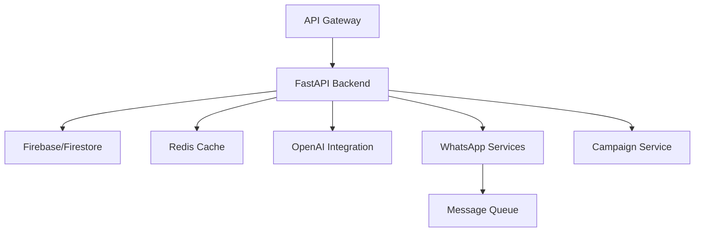

# Porfin Backend Service

A high-performance, AI-powered WhatsApp automation platform backend built with FastAPI, providing robust APIs for customer communication automation, virtual assistant management, and campaign orchestration.

## Project Overview

### Technology Stack
- **Framework**: FastAPI 0.100.0+
- **Language**: Python 3.11+
- **Database**: Firestore
- **Cache**: Redis 4.6.0+
- **AI Integration**: OpenAI API
- **Authentication**: Firebase Admin 6.2.0+
- **Message Processing**: WhatsApp Business API

### System Architecture


### Key Features
- WhatsApp message automation and routing
- AI-powered virtual assistant management
- Campaign creation and orchestration
- Real-time analytics and reporting
- Secure authentication and authorization
- Rate limiting and request throttling
- Asynchronous message processing
- Scalable microservices architecture

## Prerequisites

### Required Software
- Python 3.11 or higher
- Docker and Docker Compose
- Poetry package manager
- Git

### Required Credentials
- Firebase service account credentials
- WhatsApp Business API credentials
- OpenAI API key
- Redis instance access

### Development Tools
- VS Code with Python extension
- Python debugger (debugpy)
- Pre-commit hooks
- Postman or similar API testing tool

## Development Setup

### Environment Configuration
1. Clone the repository:
```bash
git clone https://github.com/your-org/porfin.git
cd porfin/src/backend
```

2. Copy environment template:
```bash
cp .env.example .env
```

3. Install dependencies:
```bash
poetry install
poetry run pre-commit install
```

4. Start development services:
```bash
docker-compose up -d
```

5. Run database migrations:
```bash
poetry run alembic upgrade head
```

### Development Server
Start the development server with hot reload:
```bash
poetry run uvicorn app.main:app --reload --host 0.0.0.0 --port 8000
```

For debugging:
```bash
poetry run python -m debugpy --listen 0.0.0.0:5678 -m uvicorn app.main:app --reload
```

## Project Structure

```
src/backend/
├── alembic/              # Database migrations
├── app/
│   ├── api/             # API endpoints
│   ├── core/            # Core functionality
│   ├── models/          # Data models
│   ├── schemas/         # Pydantic schemas
│   ├── services/        # Business logic
│   └── utils/           # Utility functions
├── tests/               # Test suite
├── .env                 # Environment variables
├── docker-compose.yml   # Docker configuration
├── pyproject.toml       # Project dependencies
└── README.md           # This file
```

## API Documentation

### Authentication
- JWT-based authentication using Firebase Admin SDK
- Token refresh mechanism
- Role-based access control (RBAC)
- API key authentication for service-to-service communication

### API Versioning
- Current version: v1
- Base path: `/api/v1`
- Version included in URL path
- Backward compatibility maintained

### Rate Limiting
- Default: 100 requests per minute per user
- WhatsApp API: 1000 messages per day per number
- Campaign endpoints: Custom throttling based on plan
- OpenAI endpoints: 3 requests per second

## Testing

### Running Tests
Run the full test suite:
```bash
poetry run pytest
```

Generate coverage report:
```bash
poetry run pytest --cov=app --cov-report=html
```

Run specific tests with logging:
```bash
poetry run pytest -v -s --log-cli-level=INFO
```

### Test Organization
- Unit tests: `tests/unit/`
- Integration tests: `tests/integration/`
- End-to-end tests: `tests/e2e/`
- Fixtures: `tests/conftest.py`

## Deployment

### Environment Variables

| Variable | Description | Required | Default |
|----------|-------------|----------|---------|
| APP_ENV | Application environment | Yes | development |
| DEBUG | Enable debug mode | No | false |
| API_V1_PREFIX | API version 1 prefix | Yes | /api/v1 |
| REDIS_URL | Redis connection URL | Yes | redis://localhost:6379/0 |
| FIREBASE_CREDENTIALS | Firebase credentials path | Yes | ./firebase-credentials.json |
| OPENAI_API_KEY | OpenAI API key | Yes | None |

### Production Dependencies
- fastapi ^0.100.0
- pydantic ^2.0.0
- sqlalchemy ^2.0.0
- alembic ^1.11.0
- redis ^4.6.0
- firebase-admin ^6.2.0
- openai ^0.27.0
- python-jose[cryptography] ^3.3.0
- passlib[bcrypt] ^1.7.4
- python-multipart ^0.0.6
- aiohttp ^3.8.5

### Development Dependencies
- pytest ^7.4.0
- black ^23.7.0
- mypy ^1.4.0
- pylint ^2.17.0
- pytest-cov ^4.1.0
- pytest-asyncio ^0.21.0
- debugpy ^1.6.7
- pre-commit ^3.3.3

### Health Checks
- `/health`: Basic application health
- `/health/live`: Liveness probe
- `/health/ready`: Readiness probe with dependency checks

### Monitoring
- Prometheus metrics endpoint: `/metrics`
- Custom business metrics
- Performance monitoring
- Error tracking
- Resource utilization

### Backup Strategy
- Daily Firestore backups
- Point-in-time recovery
- Regular configuration backups
- Automated backup testing

## Security Considerations

### Authentication Flow
1. Client authenticates with Firebase
2. Backend validates Firebase token
3. JWT issued for subsequent requests
4. Token refresh handled automatically
5. Session management via Redis

### Data Protection
- All sensitive data encrypted at rest
- TLS 1.3 for data in transit
- Field-level encryption for sensitive data
- Secure credential management
- Regular security audits

### Error Handling
- Standardized error responses
- Detailed logging (non-sensitive)
- Error tracking and alerting
- Rate limit violation handling
- Graceful degradation

## Contributing

### Development Workflow
1. Create feature branch from `develop`
2. Implement changes with tests
3. Run linting and type checking
4. Submit pull request
5. Pass CI/CD checks
6. Code review and approval
7. Merge to `develop`

### Code Style
- Follow PEP 8 guidelines
- Use Black for formatting
- Type hints required
- Docstrings for public APIs
- Comprehensive test coverage

## License

Copyright (c) 2023 Porfin. All rights reserved.